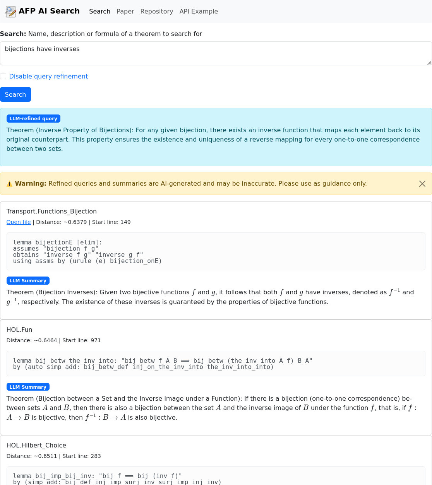

# AFP AI Search

>An AI-assisted semantic theorem finder for the Archive of Formal Proofs using sentence-transformers, ChromaDB and LLMs.

## Description
Let people know what your project can do specifically. Provide context and add a link to any reference visitors might be unfamiliar with. A list of Features or a Background subsection can also be added here. If there are alternatives to your project, this is a good place to list differentiating factors.

## Requirements

- [Python](https://www.python.org/downloads/) 3.11.2 or higher
- [pip](https://pip.pypa.io/en/stable/installation/) 23.0.1 or higher
- [Docker](https://docs.docker.com/engine/install/)
- [NVIDIA Container Toolkit](https://docs.nvidia.com/datacenter/cloud-native/container-toolkit/latest/install-guide.html)

**If you want to run this application using the GPU (highly recommended):**
- a NVIDIA GPU with at least 12 GB VRAM that supports CUDA (e.g. a NVIDIA GeForce RTX 4070)
- [NVIDIA drivers](https://www.nvidia.com/en-us/drivers/) that are compatible with CUDA version 12.8 (e.g. NVIDIA driver version 570.153.02)

## Setup

This installation guide requires the usage of Docker because it ensures containerization and reproducibility. Additionally, it doesn't require having Solr and Java installed and provides more security, because the Solr database and ChromaDB collections are only accessible inside the Docker container. You can either directly pull and run the Docker image or build and run the Docker image locally.

Embedding all theorems into the ChromaDB collection takes about 2 hours, building the FindFacts index with all sessions of the Archive of Formal proofs about 24 hours and informalizing all theorems about 25 hours. This is why I decided to provide prepared tar.gz files of them in the `artifacts/` and `assets/` folder.

In theory, the application only requires a pre-built FindFacts index as a Solr database and the application will start the informalization and embedding process of all necessary theorems. You can confirm/test this by deleting or renaming the `chroma_storages` and the `assets` folder in the running Docker container.

### Pulling and running the Docker image

The advantage of pulling and running the Docker image is that all requirements (inside the Docker image) such as Solr, Python, etc. will automatically be met and all modules, such as ChromaDB collections will be included. Personally, I recommend this method.

> ⚠️ **Warning:** The docker image is unfortunately very large (33.9 GB) because it already contains pre-generated LLM informalizations of all ~310,000 theorems, a FindFacts Solr database, a copy of the Archive of Formal Proofs, pre-installed Python packages and ChromaDB collections with all embeddings.

In order to pull the Docker image from https://gitlab.lrz.de, you have to authenticate Docker first, if you haven't already. If you can't authenticate with GitLab, please refer to [Building the Docker image locally](#building-and-running-the-docker-image-locally):

```bash
docker login gitlab.lrz.de:5005
```

Please enter the same username and password that you also you to log in at https://gitlab.lrz.de.

Next, to pull and run the latest Docker image, simply run:

```bash
docker run -p 5000:5000 --gpus all -it gitlab.lrz.de:5005/kadlez/afp-ai-search
```
Alternatively, you can also find this command in `docker_run.sh`.

This command will redirect port 5000 inside the Docker container onto your computer, i.e. accessing port 5000 on your computer will be redirected to port 5000 inside the Docker container. `--gpus all` will only work if the NVIDIA Container Toolkit has been installed and allows Docker to access your GPU. `-it` (interactive, tty) opens a Shell inside the container after running the image.

When the application finished starting up, you can open the website at http://localhost:5000/.

> ⚠️ **Warning:** If the NVIDIA Container Toolkit has not been installed correctly, a GPU that does not support CUDA is used or a NVIDIA driver with an incompatible CUDA version has been installed, the application will automatically fallback to using the CPU, instead. As a result, search queries will take much longer (~20 seconds on an Intel(R) Core(TM) i7-8700K CPU @ 3.70GHz) to process due to slow LLM text generation.

### Building and running the Docker image locally

Building the Docker image locally can be done by running `docker_build.sh`. This script makes sure, that only files that are not ignored by the `.gitignore` are copied to the image. Additionally, it extracts the tar.gz files from the `assets/` folder into the `assets_extracted/` folder before copying them into the Docker image to save Docker image size.

To run the Docker image, simply run:

```bash
docker run -p 5000:5000 --gpus all -it gitlab.lrz.de:5005/kadlez/afp-ai-search
```
Alternatively, you can also find this command in `docker_run.sh`.

This command will redirect port 5000 inside the Docker container onto your computer, i.e. accessing port 5000 on your computer will be redirected to port 5000 inside the Docker container. `--gpus all` will only work if the NVIDIA Container Toolkit has been installed and allows Docker to access your GPU. `-it` (interactive, tty) opens a Shell inside the container after running the image.

When the application finished starting up, you can open the website at http://localhost:5000/.

## Output

If everything works correctly, the output should look like this:

```bash

```

You can access the website at http://localhost:5000/.

## Screenshot

Below you can find a screenshot of the web UI:



## Pre-Commit

pre-commit install

## Acknowledgment
Show your appreciation to those who have contributed to the project.
